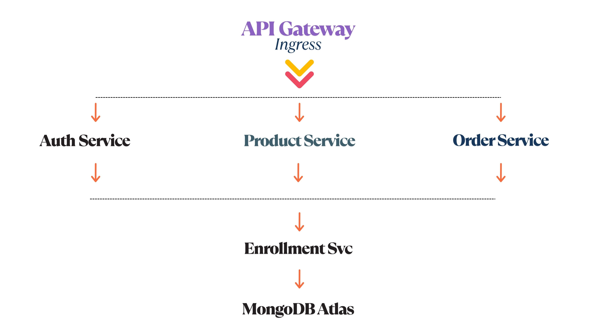

# T2S Microservices – Multi-Cloud Deployment (EKS + AKS + GKE)

## Overview

This project demonstrates the transformation of the [api-restful-nodejs-express](https://github.com/Here2ServeU/api-restful-nodejs-express) monolithic e-commerce API into a modern, containerized microservices architecture. The microservices are deployed across Amazon EKS (Elastic Kubernetes Service), Microsoft Azure AKS (Azure Kubernetes Service), and Google Cloud GKE (Google Kubernetes Engine) — ensuring cloud agnosticism, scalability, and fault tolerance.

### Tools Used:
- **Terraform**: Infrastructure as Code (IaC) tool used to automate provisioning of Kubernetes clusters across all three cloud providers.
- **Helm**: Kubernetes package manager that simplifies deploying, upgrading, and managing Kubernetes applications (each microservice is packaged as a Helm chart).
- **GitHub Actions**: CI/CD pipeline used for automated testing and deployment across environments.

## Microservices Breakdown

Each service is independently developed and deployed, enabling modular scalability, easier maintenance, and better fault isolation.

- **Auth Service**  
  Handles user registration, login, and authentication workflows using JWT (JSON Web Tokens) for secure identity management.

- **Product Service**  
  Manages product-related operations including catalog creation, updates, and retrieval — supports CRUD operations for e-commerce product data.

- **Order Service**  
  Orchestrates order processing including cart checkout, payment integration, and order tracking.

- **Enrollment Service**  
  Facilitates course or service enrollment, capturing user registrations for training or digital content.

## Architecture Diagram



This diagram illustrates the decoupled services, cloud-native orchestration with Kubernetes, and CI/CD automation via GitHub Actions.

## Supported Cloud Platforms

- Amazon EKS – Fully managed Kubernetes on AWS.
- Microsoft Azure AKS – Simplifies Kubernetes deployment and management on Azure.
- Google Cloud GKE – Powerful, scalable Kubernetes management on GCP.

## Setup Instructions

### 1. Clone the Repository
```bash
git clone https://github.com/Here2ServeU/t2s-microservices-multicloud.git
cd t2s-microservices-multicloud
```

### 2. Provision Kubernetes Infrastructure

Use Terraform to provision clusters on each cloud platform:

- AWS EKS
```bash
cd terraform/aws-eks
terraform init
terraform apply
```

- Azure AKS
```bash
cd terraform/azure-aks
terraform init
terraform apply
```

- Google GKE
```bash
cd terraform/gcp-gke
terraform init
terraform apply
```

### 3. Configure Kubernetes Context

Connect your local `kubectl` to the respective Kubernetes clusters:

- AWS
```bash
aws eks update-kubeconfig --name t2s-eks-cluster
```

- Azure
```bash
az aks get-credentials --resource-group t2s-rg --name t2s-aks-cluster
```

- GCP
```bash
gcloud container clusters get-credentials t2s-gke-cluster --region us-central1
```

### 4. Deploy Microservices Using Helm

Install the microservices into the cluster:
```bash
helm install auth-service helm-charts/auth-service
helm install product-service helm-charts/product-service
helm install order-service helm-charts/order-service
helm install enrollment-service helm-charts/enrollment-service
```

## Terraform Structure

```bash
terraform/
├── aws-eks/
│   └── main.tf           # AWS EKS cluster setup
├── azure-aks/
│   └── main.tf           # Azure AKS cluster setup
└── gcp-gke/
    └── main.tf           # GCP GKE cluster setup
```

---

## <div align="center">About the Author</div>

<div align="center">
  
</div>

**Emmanuel Naweji** is a seasoned Cloud and DevOps Engineer with years of experience helping companies architect and deploy secure, scalable infrastructure. He is the founder of initiatives that train and mentor individuals seeking careers in IT and has helped hundreds transition into Cloud, DevOps, and Infrastructure roles.

- Book a free consultation: [https://here4you.setmore.com](https://here4you.setmore.com)
- Connect on LinkedIn: [https://www.linkedin.com/in/ready2assist/](https://www.linkedin.com/in/ready2assist/)

Let's connect and discuss how I can help you build reliable, automated infrastructure the right way.


——-

MIT License © 2025 Emmanuel Naweji

You are free to use, copy, modify, merge, publish, distribute, sublicense, or sell copies of this software and its associated documentation files (the “Software”), provided that the copyright and permission notice appears in all copies or substantial portions of the Software.

This Software is provided “as is,” without any warranty — express or implied — including but not limited to merchantability, fitness for a particular purpose, or non-infringement. In no event will the authors be liable for any claim, damages, or other liability arising from the use of the Software.
